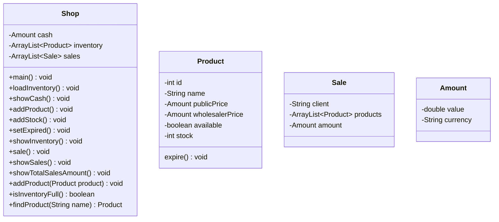

# Shop Application

## Overview
This project is a class activity developed as part of the Higher Degree in Web Application Development (Desarrollo de Aplicaciones Web) at STUCOM Pelai.

This release consolidates all fixes and enhancements reflected in the current issue list. All reported bugs have been resolved and all requested improvements have been fully implemented, resulting in a stable, consistent, and functionally complete application.

The application now behaves as expected across all menu options, with correct data handling, validation, and output.

## What’s New and Fixed

### Enhancements Implemented

* Amount data type is now used consistently across the application.
* A new menu option has been added to display the total amount of all sales.

### Bugs Fixed

* Public price is now correctly set when a new product is created.
* Public price is now correctly updated when a product is marked as expired.
* Option "7. Ver ventas" no longer throws errors and works as intended.
* Stock management now adds to the current stock instead of replacing it.
* Option "10. Salir programa" now exits the program correctly.
* Duplicate products can no longer be added to the inventory.
* Inventory view now shows full detail for each product.
* Cash display option now correctly shows the current value.

## Current Features

1. Show cash
2. Add product
3. Add stock
4. Set product as expired
5. Show inventory with full product details
6. Sale products
7. Show sales
8. Show total amount of all sales
9. Exit program

## Requirements

* Java 1.17

## Installation

```
git clone https://github.com/Stucom-Pelai/MP0485_RA4_POO_Shop
```

## Run

```
run file main.Shop.java
```

## Class Diagram


